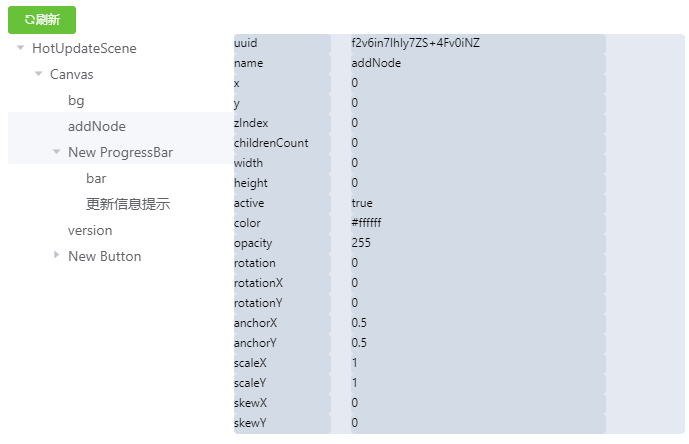

# cocos-creator-inspector
## 插件说明
本插件为chrome插件,设计该插件的初衷是方便在chrome环境下运行时调试,目前仅仅实现了很基础的工具

## 插件安装
- [安装包下载](dist.crx)   
- [点击查看如何安装](../doc/CreatorInspector/install/README.md)
## 如何使用
- 在chrome中打开creator开发的游戏
- F12打开**开发者工具**你会发现多了一个cocos选项
  
- 点击**刷新**按钮即可查看游戏运行时的节点目录树,左侧为节点,右侧为节点信息
    
## 开发中使用到的技术
- chrome 插件开发
- vue+webpack
- element-ui    
- cocos creator
## 寻求帮助
因为本人不是web前端开发出身,而这个插件使用了比较多的web前端技术,所以急切的寻求一个web前端小伙伴,共同完善这个插件,这也是本人将这个插件开源的一个重要原因
## 联系方式
QQ群**224756137**
