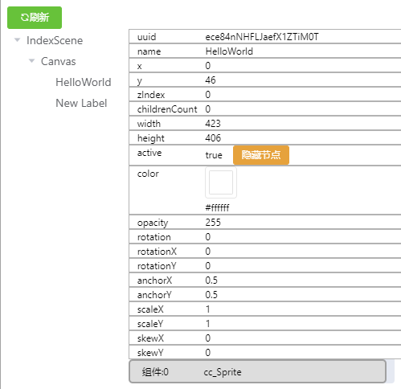
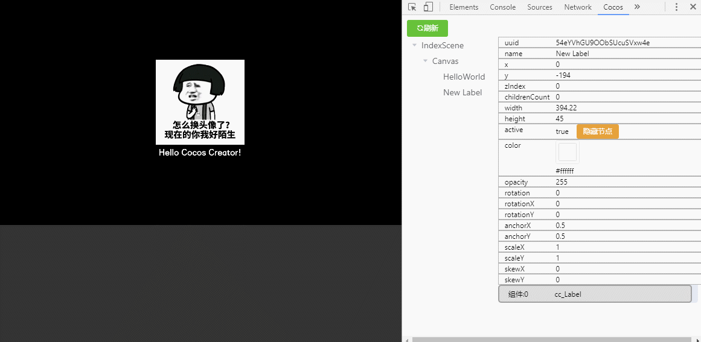

# cocos-creator-inspector
## 插件说明
本插件为chrome插件,设计该插件的初衷是方便在chrome环境下运行时调试creator游戏.
开发过程中难免翻车,为什么添加的图片看不到,为什么图片的位置有偏差,为什么.....总之,身为程序员的我们每天都在思考:我错在了哪里?如果能在运行游戏的时候,查看游戏的节点树多好啊
so...   
  
cc-inspector 插件顺势而生, 你需要的我来完成 
目前插件支持运行时查看场景的节点树信息,比如坐标,缩放,颜色,透明度,附加的组件等等,其中在节点的可视状态属性里面,提供了显示/隐藏的操作按钮,该操作会直接影响到运行时节点的可视状态,惊不惊喜,意不意外,还有这种令人窒息的操作?目前版本功能虽然单薄,但是实用性非常高,在后续版本中,会陆陆续续开发新功能,比如修改节点的坐标,缩放等等属性,当然还有一个最重要的核心功能,就是节点附加的组件,如果能动态修改组件属性,执行组件的function,简直是如虎添翼啊!好吧,总之**这是一个神奇的插件**,更多好玩的功能有待发掘,希望这只 **猫头鹰** 能作为游戏开发之旅的火眼金睛,披荆斩棘,让bug无处可藏!

### 论坛帖子地址
 http://forum.cocos.com/t/chrome-creator/55669

## 插件安装
- [安装包下载](http://7xq9nm.com1.z0.glb.clouddn.com/ccInspector_v1.1.zip)   
- [点击查看如何安装](../doc/CreatorInspector/install/README.md)
## 如何使用
- 在chrome浏览器中运行creator开发的游戏
- F12打开**开发者工具**你会发现多了一个cocos选项
  
- 点击**刷新**按钮即可查看游戏运行时的节点目录树,左侧为节点,右侧为节点信息
   
  - 节点信息中有控制显示隐藏的按钮,点击该按钮将直接影响运行中的游戏效果
     
  - 节点属性列表中显示了改节点上挂的所有组件,目前仅仅支持查看组件名称,并不能实时编辑   
## 开发中使用到的技术
- chrome 插件开发
- vue+webpack
- element-ui    
- cocos creator
## 寻求帮助
因为本人不是web前端开发出身,而这个插件使用了比较多的web前端技术,所以急切的寻求一个web前端小伙伴,共同完善这个插件,这也是本人将这个插件开源的一个重要原因
## 联系方式
QQ群**224756137**
