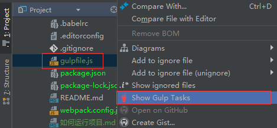
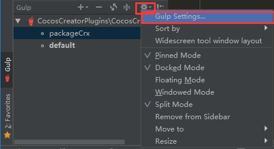
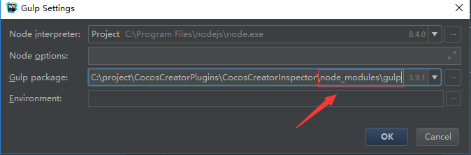

# 如何运行项目
## 使用前
在使用之前,需要在项目目录CocosCreatorInspector下执行npm install 命令,初始化项目所需的依赖包


# 如何打包插件
## 命令行方式
- 为了能够在计算机上让gulp直行任务，所以我们需要全局安装gulp。在终端执行：
```$xslt
cnpm install gulp -g
```
- 安装完成后，我们可以同样通过命令查看是否安装成功：
```$xslt
gulp -v
```
- 运行打包任务
```$xslt
gulp packageCrx
```
## 在webstorm中运行gulp任务
- 在gulpfile.js文件上右击选择**Show Gulp Tasks**

- 如果webstorm没有检测到任务列表,需要设置下安装包,点击**设置**,
打开**Gulp Settings...**

- 设置gulp模块的物理地址,注意图中红框设置的地址

- 在webstorm中的gulp视图刷新任务列表
- 双击**packageCrx**,执行打包插件任务
