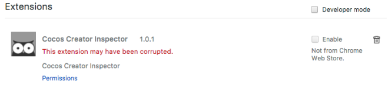

# 重要说明
安装cc_inspector插件前请您先查看下自己chrome浏览器的版本，在帮助》关于中查看版本，
- 如您的浏览器版本大于或等于63.x.x.x请使用开发者安装模式
- 如小于63.x.x.x您可以使用普通安装模式。

## 1.开发者安装模式(推荐)
* 打开Chrome，转到Chrome扩展工具页 (可以直接输入chrome://extensions/ 打开)。
* 先把开发者模式打开。
  
* 解压后你会发现*.crx文件,这个是chrome的插件安装文件,需要将*.crx修改为*.zip,然后再次解压.
* 点击加载已解压的扩展程序，点击弹出浏览文件夹，选择刚刚解压出来的文件夹。
  
* 点击确定安装，安装完成的状态：
  
* 如果没有安装成功,或者遇到任何安装困难,我感觉你需要阅读一下这篇文档: [chrome怎么安装非官方插件](https://www.jianshu.com/p/438e15fec81b)

## 2.普通安装模式

* 注意您的chrome浏览器一定要小于63.x.x.x版本才可以使用。
* 把下载的crx文件直接拖动到Chrome的扩展工具窗口中
	
* 点击确定安装
* 安装完成的状态：
	
* 如果是这样,原因是因为你的chrome版本过高导致,为了防止扩展程式被病毒木马或恶意软件修改，Chrome的扩展程序安全验证机制， 会比对本地扩展和Chrome商店中的扩展是否一致，如不匹配就会出现这个错误。
    
    
* 碰到上述情况,请使用 **开发者安装模式** ,如果对插件的安全性存在疑问,请自行阅读源码,修改打包即可!	

> 为保证工具可用，请重新启动浏览器
