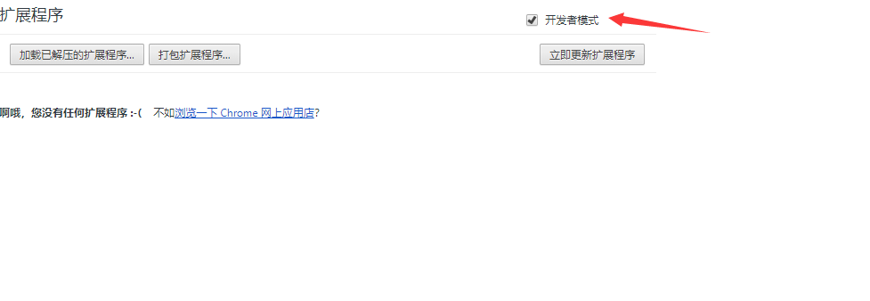
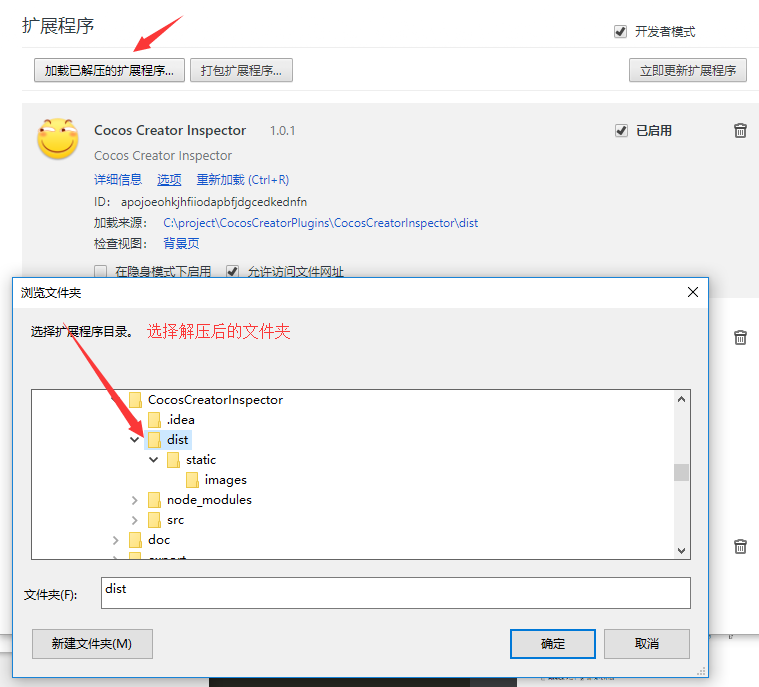
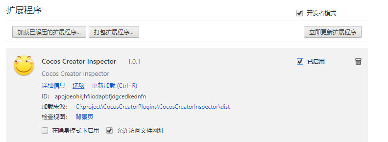
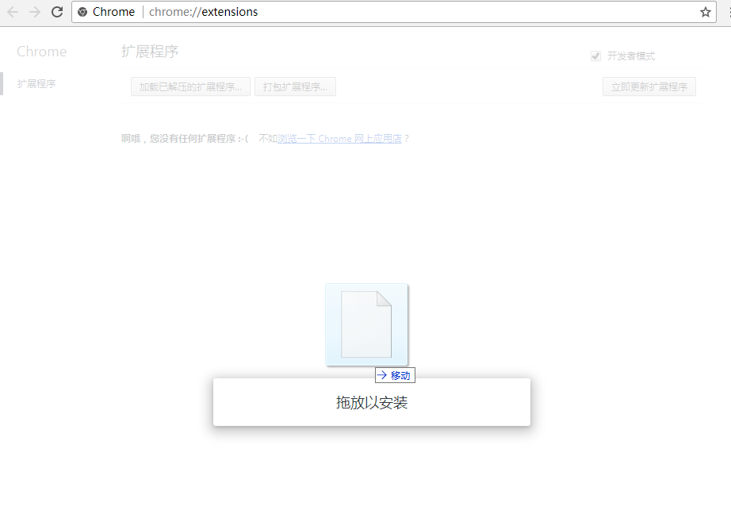
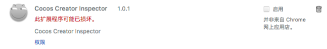

安装inspector插件前请您先查看下自己chrome浏览器的版本，在帮助》关于中查看版本，如何您的浏览器版本大于或等于63.x.x.x请使用开发者安装模式，如小于63.x.x.x您可以使用普通安装模式。

## 开发者安装模式

* 打开Chrome，转到Chrome扩展工具页 (可以直接输入chrome://extensions/ 打开)。
* 先把开发者模式打开。
  
* 然后会出现加载已解压的扩展程序，点击弹出浏览文件夹，选择刚刚zip解压出来的EgretInspector-install文件夹。
  
* 点击确定安装，安装完成的状态：
  

## 普通安装模式

* 注意您的chrome浏览器一定要小于63.x.x.x版本才可以使用。
* 把下载的crx文件直接拖动到Chrome的扩展工具窗口中

	

* 点击确定安装
* 安装完成的状态：
	
* 如果是这样,原因是因为你的chrome版本过高导致,请使用 **开发者安装模式**
    
    	

> 为保证工具可用，请重新启动浏览器