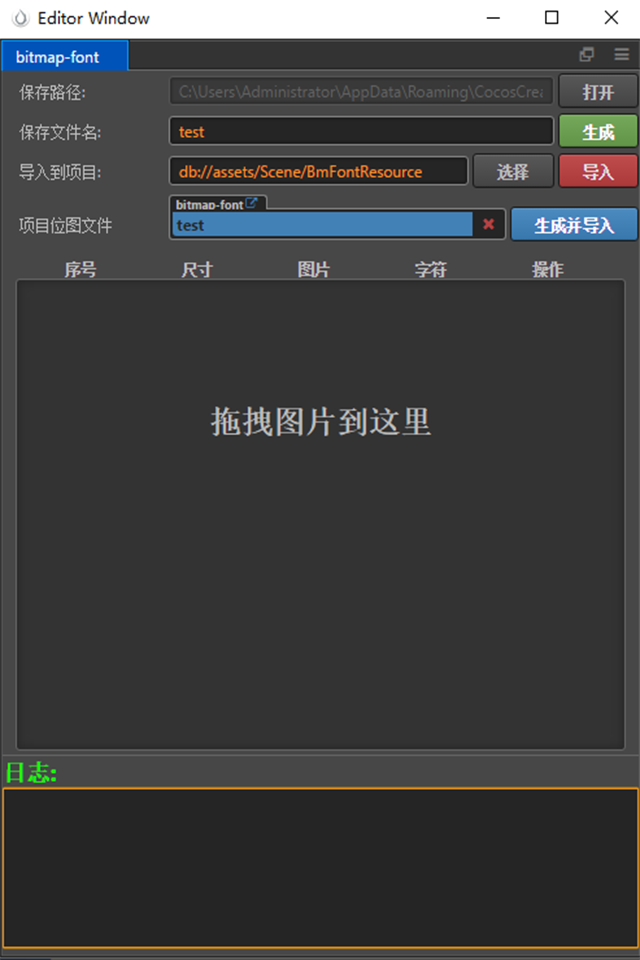
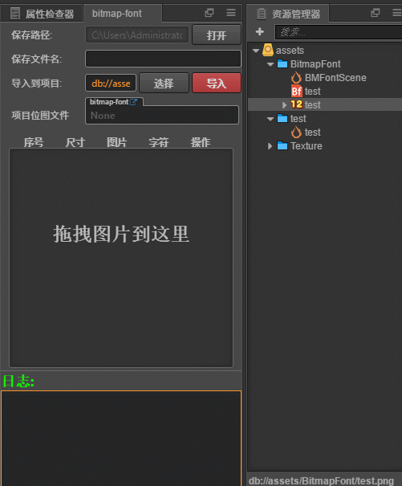
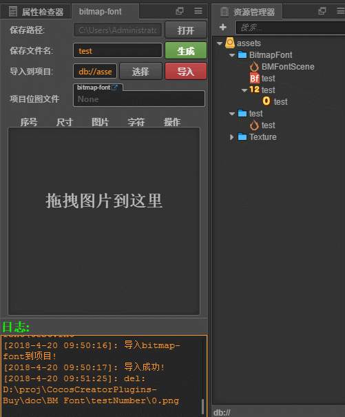

# 说明
游戏开发中经常会碰到制作BMFont字体的需求,市面上有很多专门的工具都在解决这个问题,其中最有名气的当属BMFont,然而这个工具的交互做的真心烂,特别是导入图片,指定ANSCII码的操作,特别繁琐,每次制作BMFont字体都特别麻烦,而这个插件就是在解决这个问题

# 使用
在UI界面上可以看到几个需要填写的参数
- 存放路径:生成的fnt,png图片保存的位置,为了方便起见,插件默认指定了一个位置
- 保存文件名: 生成的fnt,png的文件名
- 导入到项目: 这个参数必须指定在项目的assets目录下,'导入'操作就是将生成的png,fnt导入到指定的项目位置
- 项目位图文件: 更新项目位图文件时使用,和creator无缝对接使用

# 动态图教程
## 当生成单独的位图文件时

## 当和creator配合使用,更新项目位图文件时

## 彩蛋
- 插件对你导入的图片,按照字母或者数字顺序进行了简单的排序,这样方便你查看,符合人的阅读习惯,记住,排序的前提是你对图片名字进行了有规律的命名
- 输入bitmap的字符时,插件进行了字符校验,比如你输入了11322324,那么插件永远只会截取第一个字符1,之后的都会被忽略,至于为什么,你需要了解下什么是bitmap-font!

## 如何导入位图?
在插件中间区域就是导入的位图字体信息,导入一张图片,只需要拖拽图片到该区域即可   
需要注意的是,目前插件只能是被png图片,如果指定重复路径的图片文件,那么插件将不会导入.
## 导入位图之后
导入位图之后,可以在列表中看到该图片的详细信息,在字符一栏可以输入该图片对应的字符,在输入完毕字符后,插件会自动进行校验,如果是空字符或者输入了重复的字符,那么字符栏颜色会变红,方便识别问题

## 如何删除字符
- 如果不小心导入了其他图片,那么可以在操作列点击**删除**按钮,或者在该行任意位置**右键=>删除** 进行删除
- 删除全部: **右键=> 删除全部** 会删除当前拖入的所有字符图片

## 其他
如果使用过程中遇到任何问题,请仔细观察输出的日志信息,如果还有疑问,欢迎联系QQ群**224756137**