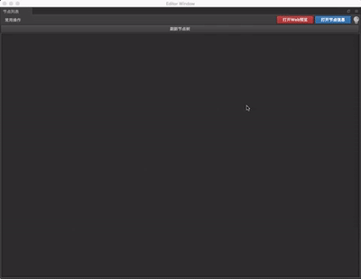
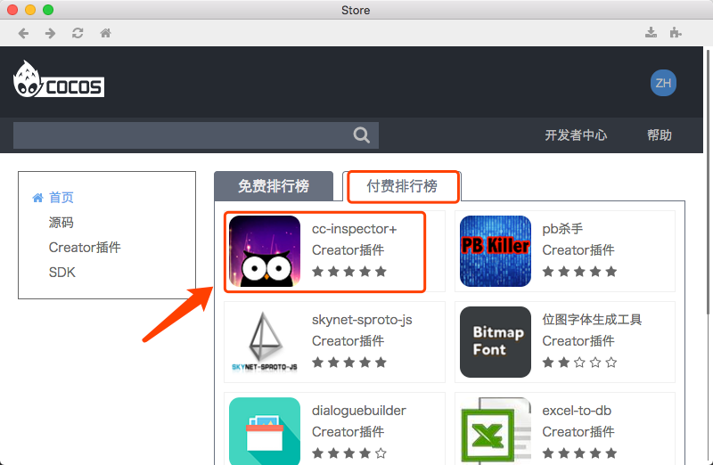
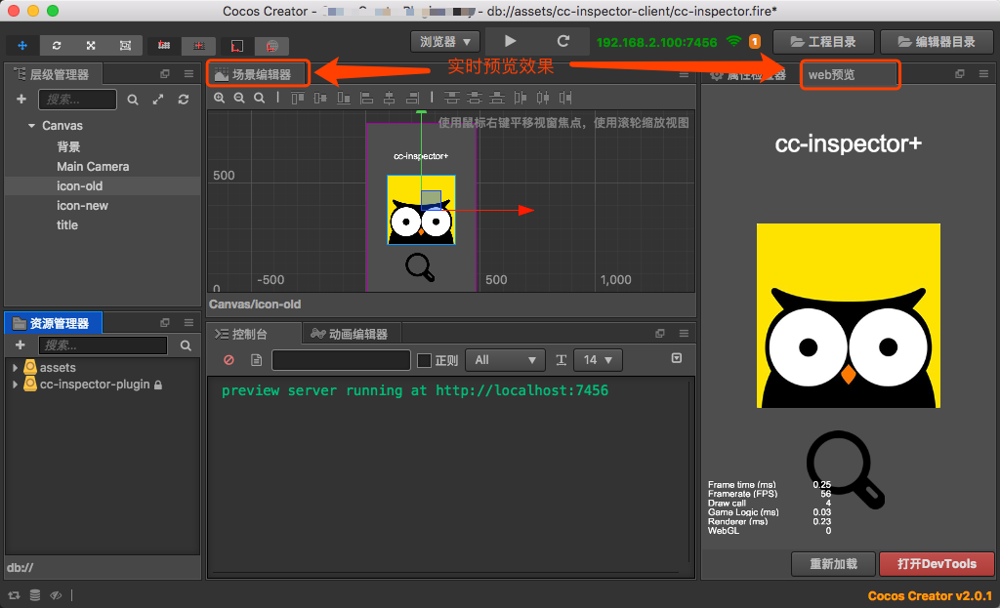
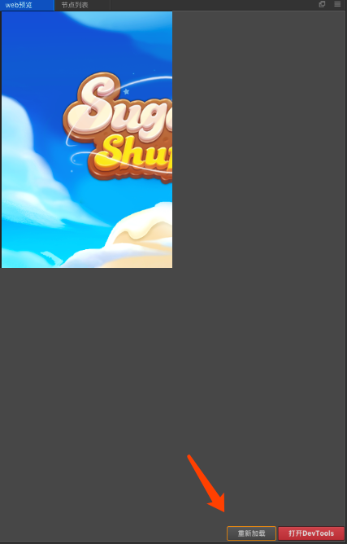
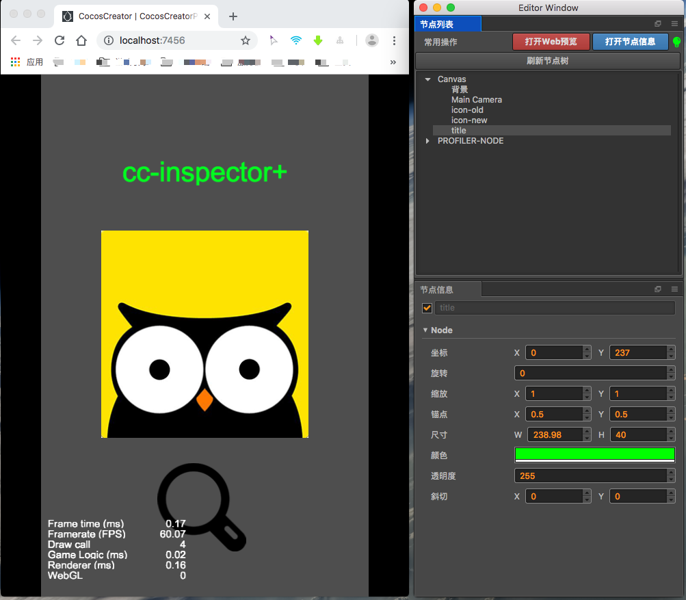

# cc-inspector+
从cc-inspector第一个版本发布,到今天cc-inspector+的发布,经历的了将近一年的时间,在这一年的时间里面,creator也在飞速发展,论坛中也有不少开发者有类似unity那样运行时查看节点树的需求,作者本人也是一名普通的开发者,当然也少不了这样的需求,这个插件的发布,对开发者无疑是一个福利,算是送个大家的国庆节大礼包!

## 插件靓照
菜单位置: **菜单=>cc-inspector=>打开**

### 使用动态图

插件的核心功能,简单来说一句话: 查看游戏运行时节点树结构

围绕着核心功能,插件提供了预览游戏窗口,节点树列表窗口,节点信息窗口.
安装插件后第一件要做的事情,就是像像上图一样,拖拽好自己喜欢的布局,下面来具体说下各个窗口的功能:

### 游戏预览窗口
这个窗口是实时预览游戏的,核心技术也不瞒大家,其实就是嵌套了一个webview,加载 **http://localhost:7456** ,所以,这就强大了,基本上是和chrome等浏览器环境里面运行游戏一模一样,当然你也可以在这个窗口调试游戏,唯一不同的是,需要点击下方的红色按钮**打开DevTools**,打开开发者工具,然后具体的debug操作,就真的和chrome一模一样了

如果想要更好玩一点,这个窗口你可以停靠在creator主界面中,有点类似unity的那个**Game窗口**,所有的开发流程,除了写代码,剩下的基本上在creator里面就能搞定.

### 节点列表窗口
这个窗口算是插件的主窗口,主要用来显示节点树,一个很赞的设计就是最右上边的**小灯泡**,这个小灯泡相当于一个指示灯,指示插件是否能够正常工作.

当打开插件后,小灯泡是灰色的,代表的意思插件目前没有检测到运行的游戏,此时是无法正常使用插件的相关功能,你可以点击红色按钮**打开Web预览**,选择使用插件默认的预览功能

当游戏运行启动的时候,小灯泡会立马变为闪烁的红灯,最后变为绿灯,表示插件已经可以正常使用了,接下来点击**刷新节点树**就会列出游戏当前状态的节点树状态,点击具体游戏节点,即可在节点信息中查看到该节点的详细信息,哈哈,没错,节点信息布局,完全模仿creator,有木有很亲切的感觉.

目前节点列表必须是**手动刷新**,在后续迭代版本中,自动刷新功能肯定是要加入进去的,真正的做到游戏节点树显示实时同步.

### 节点信息窗口

这个窗口就是想必就不用多做解释了吧,罗列节点的具体信息,美中不足的是,目前只支持显示node属性,对于组件信息,可能要稍微迭代几个版本才能加入.

另外有使用问我,在这里修改节点属性,能够影响到编辑器么,答案是,No!!!,这里仅仅是修改了运行时的属性,当游戏关闭后,你所做的所有修改都会丢失!

## 帮助
更多帮助内容,请打开**菜单=>cc-inspector=>帮助**获得更多的帮助.

## 常见问题

### 小灯泡一直灰色怎么办?   
小灯泡灰色的意思就是没有发现正在运行的游戏,此时你需要运行你的游戏即可.

### cc-inspector+和cc-inspector的区别有哪些?
**cc-inspector+** 是[cc-inspector](https://github.com/tidys/CocosCreatorPlugins/tree/master/CocosCreatorInspector)的升级版本,具体区别如下:

| 功能            |        cc-inspector  |   cc-inspector+       |
| --------        |     --------         | --------             |
| 运行环境         | chrome内核浏览器      |     cocos creator     |
| 插件类型         | chrome插件           |     cocos creator 插件 |
| 是否需要自行安装  | 是                   |     否                 |
| 第一次发布时间 | 2017/11   |     2018/10    |
| 是否迭代       | 否    |     是    |
| 技术细节      | 遵守chrome插件开发规范 |遵守creator插件开发规范|

### 如何购买插件
- 第1种方式(推荐)
    - 下载安装,打开cocos creator 软件
    - 在软件的菜单栏点击 **扩展** => **插件商店**
    - 在付费排行榜里面即可看到该插件,按照提示,自行购买.      
    
- 第2种方式: 网页链接: http://store.cocos.com/stuff/show/178979.html ,打开后按照提示进行购买

## 更多功能
- 局域网联机查看节点树: 没错,即使你游戏运行在手机上,同样可以查看节点树情况

## 推荐操(zou)作(wei)

插件小王子能想到以下搭配方式:
- 边修改编预览(暂时不推荐这种方式)
       
有个问题,需要注意的是,当切换预览的时候,可能会导致部分内容不显示      
   
所以插件这边也提供了**重新加载**按钮,来刷新页面,相关问题会在后续版本进行修复    

- chrome党专用
    
同理creator模拟器也适用,作者实际测试发现,存在问题,需要进一步解决该问题,敬请期待!
 
 
## 划重点

只需2元,就能搭上老司机的专车,还在犹豫么,再犹豫国庆后就涨价喽!

最后祝大家国庆节快乐!

