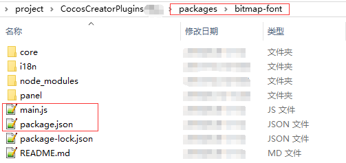

# 如何安装插件
## creator项目是严格遵守以下目录的
- xx项目
    - assets
    - library
    - local
    - settings
    - temp
    - packages
        - AA插件
            - main.js
            - package.json
        - BB插件
            - main.js
            - package.json
            
            
## 插件目录
从目录中可以观察出插件的目录结构为：
- AA插件
    - main.js
    - package.json
    
以上为最小的插件单元，所以，手动拷贝第三方creator插件，你你需要按照以上目录结构放置即可，例如

## 常见问题
- 如果出现插件未正常加载的情况，重启一下creator一般都能解决。
