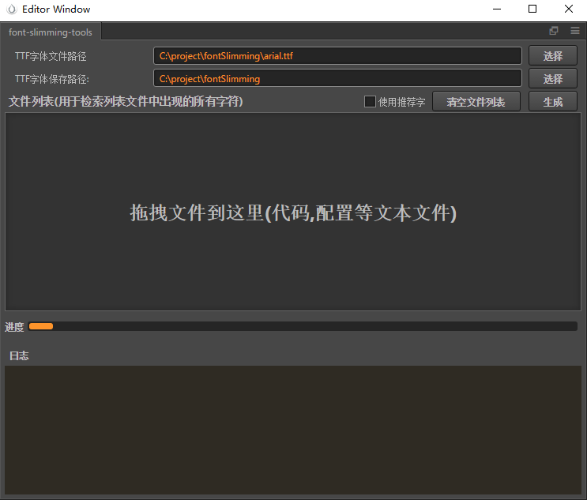
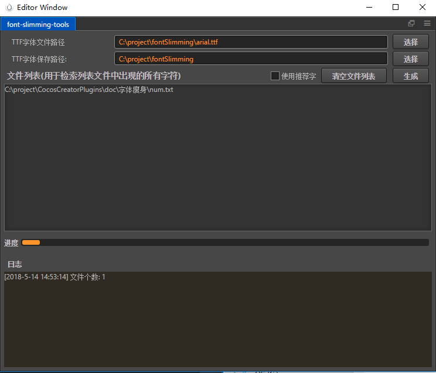

# 字体瘦身插件
## 插件说明
提供一份需要保留的字符文件,插件可以剔除字体文件中多余的字符,以达到减小ttf文件大小的目的.
 
## 插件使用
- 选择要瘦身的**字体.ttf**文件路径
- 选择新生成的**ttf字体文件**保存路径
- 拖拽文件或者文件夹到 **文件列表**  下边的区域,插件能够自动检测所有文件
- 插件本身自带了**常用推荐字**,可以勾选**使用推荐字**即可,[推荐字](SuggestString.txt)里面包含了常用的中英文
- 点击**生成**根据文件列表中的文件,插件会检索出所有不重复的字符,这些字符就是新生成的字体文件中的字符
## 其他说明
- 关于char.txt
    - 在设置的字体保存路径下,会生成一个char.txt的文件,里面的字符和ttf文件内的字符是匹配一致的.
    
- 我想自定义字符瘦身ttf字体怎么办?
    - 例如你想保留ttf字体文件中的所有数字,那么你需要创建一份[配置文件](num.txt),里面包含了"0.123456789",然后将该配置加入列表中
    
    - 
    
    - 点击生成,即可仅仅保留ttf字体中的所有数字
        
## 关于
使用过程中有任何疑问,欢迎反馈,QQ群 224756137

