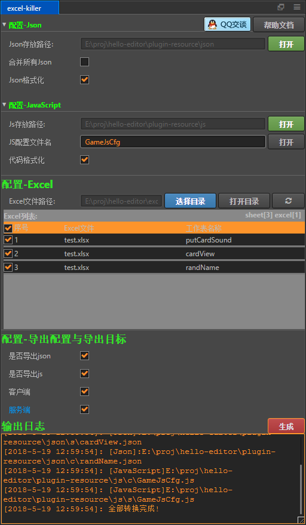

# excel-killer
## 插件说明:
插件特色:
- 插件自动监测excel文件内容变化
- 自动容错处理
- excel转json
- excel转js
- excel转lua(后续支持)
- excel转csv(后续支持)


## 插件打开方式
- 菜单:扩展/excel-killer
- 快捷键: Ctrl+Shift+J
## 格式转换说明
#### excel
##### 支持的格式:
- *.xlsx, *.xls
- [示例excel](../../doc/excel-killer/test.xlsx)
##### 内容格式如下
- 第1行: 字段的索引key,这个是不能重复的,想必这个肯定是常识吧!
- 第2行: 字段的中文注释
- 第3行: 字段的导出目标: 包含有 c 字符的代表导出到client目标，包含有 s字符代表导出到Server目标，一个表格，前端后端公用 :)
- 尽量不要出现空Sheet,当然插件会自动跳过该Sheet
- 尽量不要出现空行,空单元格,当然插件也做了这方面的优化,空单元格统一处理为空字符串,空行直接跳过
##### 水果sheet:fruit
|id| fruit        | cost      |   num    |
|:----: | :----:    | -----:  | :----: |
|编号| 水果        | 价格    |  数量  |
|cs| cs        | cs    |  cs  |
|1| 香蕉        | 1      |   5    |
|2| 苹果        | 1      |   6    |
|3| 草莓        | 1      |   7    |
##### 人类sheet:man
|id| name        | age         |
|:----: | :----:    | -----:    |
|编号| 名字        | 年龄       |
|cs| cs        | cs       |
|1| 小明       | 10           |
|2| 小红        | 20         |
|3| 小蓝        | 30          |


#### 转换的js代码为
```javascript
module.export = {
        fruit: {
            1: {fruit: "香蕉", cost: 1, num: 5},
            2: {fruit: "苹果", cost: 1, num: 6},
            3: {fruit: "草莓", cost: 1, num: 7}
        },
        man: {
            1: {name: "小明", age: 10},
            2: {name: "小红", age: 20},
            3: {name: "小蓝", age: 30},
        }
    }
```
#### 转换的json文件为:
- 未合并的json
> fruit.json
```json
{
    "1": {"fruit": "香蕉", "cost": 1, "num": 5},
    "2": {"fruit": "苹果", "cost": 1, "num": 6},
    "3": {"fruit": "草莓", "cost": 1, "num": 7}
}
```
> man.json
```json
{
    "1": {"name": "小明", "age": 10},
    "2": {"name": "小红", "age": 20},
    "3": {"name": "小蓝", "age": 30}
}
```
- 合并后的json
```json
{
    "fruit": {
        "1": {"fruit": "香蕉", "cost": 1, "num": 5},
        "2": {"fruit": "苹果", "cost": 1, "num": 6},
        "3": {"fruit": "草莓", "cost": 1, "num": 7}
    },
    "man": {
        "1": {"name": "小明", "age": 10},
        "2": {"name": "小红", "age": 20},
        "3": {"name": "小蓝", "age": 30}
    }
}
```


## 使用说明:
### 配置-json
#### json存放路径:
> 插件自动指定路径,不能手动指定,生成的json配置会统一存放在该目录下

#### json格式化:
> 勾选该选项,生成的json文件将会格式化之后输出,例如:
```json
{
    "test":100
}
```
>未勾选该选项,生成的json将会是一行,例如:
```json
{"test":100}
```
从上边观察可以看出:
- 格式化后的json更容易查阅,但是文件体积比较大,适合开发的时候使用
- 未格式化的json文件体积比较小,但是不容易查阅,适合项目发布的时候使用
#### 合并所有Json:
- 未勾选该选项,每个excel的sheet会生成一个对应的json配置,因此,需要保证sheet不能出现重名
- 勾选该选项,所有的json配置将合并为一个json,因此,需要手动指定json配置的文件名

### 配置-JavaScript
#### js存放路径:
> 插件自动指定路径,不能手动指定,生成的js配置会统一存放在该目录下
#### js配置文件名
> 生成的js配置的文件的名字
#### 代码格式化
> 勾选该选项,生成的js文件将会格式化之后输出,例如:
```javascript
module.exports={
    test:"100"
}
```
> 未勾选该选项,生成的js文件将会是一行,例如:
```javascript
module.exports={test:"100"}
```
是否使用该选项,和上边的同理,视情况而定.
### 配置-Excel
### Excel文件路径:
> 需要手动指定自己的excel所存放的目录,插件会识别出来目录下的所有excle文件,因此允许目录嵌套的方式存放excel
### Excel列表
- 列表中罗列出来了目录下的所有excel的sheet
- 标题右侧 **sheet[x] excel[y]** 的意思是,目录下sheet一共x个,excel文件一共y个
- 每个sheet列表条目都有一个选中项,如果勾选,则会加入到生成队列中,反之不会被生成,默认全部选中

## 插件反馈
- 详细的说明文档:点击插件的[帮助按钮](https://github.com/tidys/CocosCreatorPlugins/tree/master/packages/excel-killer/README.md)直达
- 如果使用过程中遇到任何问题,欢迎点击[QQ交谈](http://wpa.qq.com/msgrd?v=3&uin=774177933&site=qq&menu=yes)给我留言

