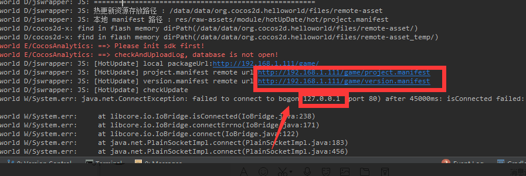
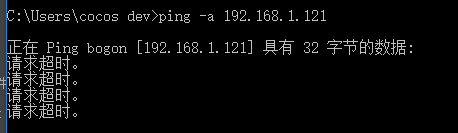
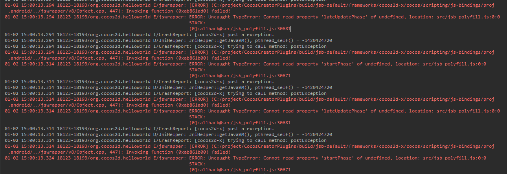

# 常见问题
## 说明
这里是作者热更新过程中遇到的一些问题,仅供参考

### 局域网测试时,为啥我的热更新请求地址是bogon(127.0.0.1)

- 导致原因
    - 开发环境所在的局域网路由器可能设置了ip虚拟化导致这个问题
    - 此时你可以ping一下同局域网的电脑,如果和下图一样,主机ip为bogon,那么很有可能是ip虚拟化导致看不到主机名字  
        
- 解决办法:
    - 可以发布到公网测试下,如果在公网环境仍然存在这个问题,那么很有可能就是代码的问题!
    - 如果仍然想在局域网环境测试,Windows的话,务必确认已经关闭本机防火墙,再次尝试
### 热更新黑屏,报错如图

尝试着使用gradle:2.3.0 也许能够解决问题  
文件地址: proj.android-studio/build.gradle
```
 classpath 'com.android.tools.build:gradle:2.3.0'        
```
