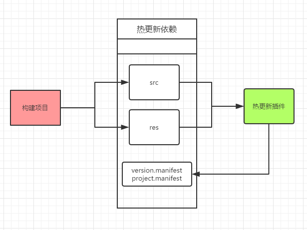

# hot-update-tools
## 工具说明
本工具仅仅是对官方的热更新方案的一个可视化解决方案,可以帮助你快速生成project.manifest和version.manifest文件,并且提供了本地测试的一些常用操作
使用前请移步官方热更新教程 https://github.com/cocos-creator/tutorial-hot-update


## 使用说明
- 菜单位置: 项目 => 热更新工具(Ctrl+H)
- 使用该工具前,必须执行 **项目=>构建** ,插件自身带有构建提示,仅仅作为构建参考!
- 项目工程中必须存在manifest文件,如果是第一次使用,请使用该插件生成一份manifest文件并导入到项目中
- 在发布平台安装包的时候,建议当前的manifest配置和当前项目的资源是吻合的,否则,可能会造成更新后的未知问题



 
### 界面一共包含4部分,下边是具体的说明
#### 第1部分:生成Manifest操作
在这部分你可以看到有2个需要你填写的参数:
- 版本号:
```
游戏热更新版本号,这个版本号建议是x.x的格式,例如1.2, 2.01等
```

- 资源服务器url:
```
游戏热更新资源的服务器url,即客户端发起热更新http请求的url
例如你的服务器地址为100.200.300.400,那么这里你需要填写 http://100.200.300.400
如果你有目录层级,比如我放在了gameUpdate目录下,那么这里你就需要填写 http://100.200.300.400/gameUpdate
也就是说你最终填写的这个url+"project.manifest",能够在浏览器中正确访问,那么这个url就是有效的,不懂得请仔细查阅官方热更新文档
```
同是你看到有2个参数是不可编辑的
- build项目资源文件目录
```
如果你执行过 项目=>构建 的话,那么在插件启动时,该目录就会默认指向build/jsb-default,如果该目录下的src,res就是热更新要的文件,如果插件启动后,该参数为空,日志会提示需要你构建一下项目
```
- manifest存储目录
```
该参数会在插件启动时默认初始化,指向的目录就是最终热更新生成的manifest文件存放处,该参数对于开发者是透明,避免参数过多,造成混淆
```
#### 第2部分:检测当前游戏的状态
开发这个功能原因:
- **经常看到其他人在填写版本号的时候,填写的很随意,不知道当前游戏版本号是多少,很容易填写的版本号比当前运行游戏的版本号要低,然后反馈给我说游戏热更新不能用**

在这个界面里更方便的查看当前项目里面的版本信息
- 项目中使用的manifest
- package url
- 游戏版本号

需要注意的是
**如果项目中的manifest文件发生变动,该插件不会主动刷新,需要手动点击刷新按钮**

#### 第3部分:方便进行本地测试
当第1部分的参数配置ok,点击**生成**按钮,顺利生成manifest文件后,你可能需要进行一下本机的一个简单测试,那么这个功能就是为此开发的
- 使用前请先指定本地的server物理路径
- 部署
```
该操作会将生成的manifest文件,src,res,三部分文件一同拷贝到指定的server路径里
```
- 清理模拟器
```
该操作会删除creator自带模拟器的热更新缓存
windows下为:creator\resources\cocos2d-x\simulator\win32\remote-asset
```

#### 第4部分: 日志
这里显示了一些插件的操作提示,如果使用过程中出现问题,请耐心阅读提示,也许能够得到帮助
#### 最后
工具仅仅是原理的一个友好帮助,在使用的过程中,还是希望使用者能够对官方的热更新文档进行仔细的阅读,这样才能更加透彻的理解和使用该工具.


## 如何导出热更新资源
有2种方式:
- 1.插件的部署操作里面,你可以指定一个目录,该操作会将热更新的所有资源放到那个目录里面,你可以手动压缩这里的文件.
- 2.插件在执行**生成**操作的时候,会在 **项目目录/packVersion/** 下生成一个包含版本号的zip包,比如:ver_1.1.zip, 这个压缩文件就是你需要的热更新资源包

## 关于
- 该工具是自己游戏开发生涯中的一个小积累
- 如果你喜欢,请告诉你的小伙伴,
- 如果不喜欢,请告诉我哪里不好(企鹅 774177933),或者直接在Issues里面提问,帮助我完善它

## 其他文档
[更新记录](UPDATE.md)  
[常见问题](CommonIssue.md)
## QQ打赏:

