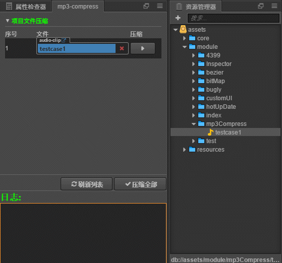
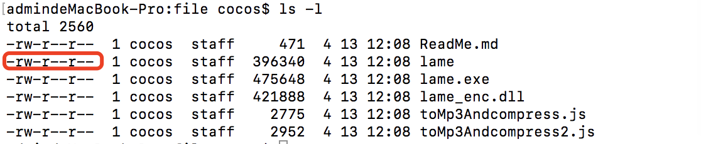

# 插件说明
在保证mp3音频文件质量的前提下,对mp3文件进行瘦身,减小mp3文件体积的大小

## 其他说明
项目中使用了lame
- npm地址: https://www.npmjs.com/package/node-lame
- sourceforge地址: http://lame.sourceforge.net/

## 插件使用
- 打开快捷键: Cmd/Ctrl + m
- 目前插件只会对mp3进行压缩,所以建议项目使用mp3类型音频文件
## 使用动态图

## 压缩效果
- [压缩前文件 9.79k](../../doc/mp3-Compress/testcase.mp3)
- [压缩前文件 4.94k](../../doc/mp3-Compress/testcase-compress.mp3)

## 帮助
在mac平台下,执行lame需要运行权限,插件会自动授予权限,如果插件提示了权限问题,需要再次检查下lame的权限

