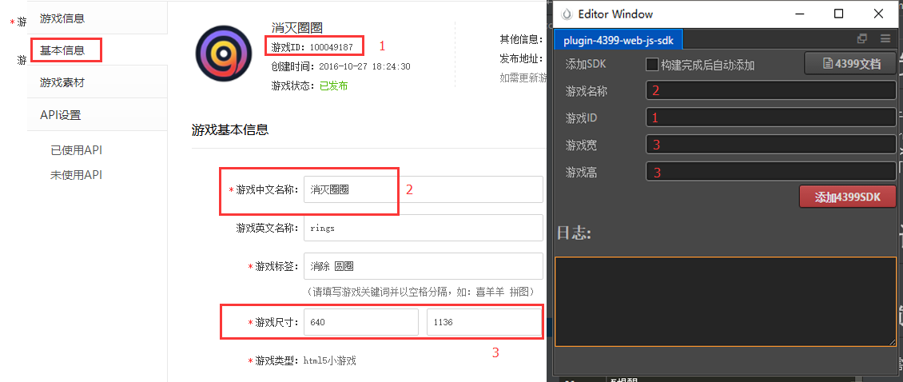

# 插件说明
- 快速帮你集成4399原创平台SDK,[插件开源地址](https://github.com/tidys/CocosCreatorPlugins/tree/master/packages/plugin-4399-web-js-sdk)

# 关于4399原创平台
- 网址: http://www.4399api.com/welcome
- 文档: 4399原创平台[sdk文档地址](http://www.4399api.com/res/api/html5)
1. 这个平台能发布什么游戏呢?            
只能发布web游戏,游戏类型不限,一个这个平台的web小游戏很多
2. 这个平台能盈利吗?            
目前来说这个平台只能挣一点小钱,也别期望太高,平台的小游戏的盈利方式主要还是广告,并且接入的广告不是自己控制的,是sdk自己自动添加的,平台的大部分玩家都是儿童,平台会定期搞一些形象定制游戏的活动,所以如果你的小游戏能够迎合平台的需求,那么平台会提高你的曝光率,相应的你的广告费也会有所提高.
3. 平台有cocos creator 发布的游戏吗?             
根据本人的观察,还是有的,不过因为其他引擎对4399支持比较好,从文档中你也能看到,所以creator目前还是靠插件去完善这个工作,
4. 有示例游戏吗?              
有的,插件作者很久之前也发布了几款小游戏,不过不是creator开发的,但是收益几乎为0,一度很是伤心
想瞅瞅的客官点击这里:   http://www.4399.com/flash/181547_1.htm
# 插件安装
- 在插件商店下载并安装插件(推荐项目安装)
- 打开creator,点击**菜单=>扩展=>439WebSdk插件**即可打开插件
# 使用说明
## 使用前准备    
 - 首先需要注册个开发者账号,在开发者后台创建一个游戏
## 插件参数说明
- 参数填写: 游戏名称,游戏ID,游戏宽高 这些参数全部来自4399游戏管理后台
- 勾选**构建完成后自动添加**,构建web-desktop/web-mobile后插件能够自动添加sdk代码
- 当游戏参数变动时,修改后点击**添加4399SDK**即可更新SDK信息
### 参数填写如图所示

# 重要提醒
当项目构建完成之后,插件会自动在main.js中给window对象添加了如下函数
```javascript
window.moreGame=function(){
    h5api.moreGame();
};
```
之所以这么做是因为4399原创平台要求必须调用这个接口,所以在项目代码中需要手动这么调用
```javascript
if(window.moreGame){
    window.moreGame();
}
```
一般来说,这段代码是写在**更多游戏**按钮点击事件里面的
# 帮助
使用过程中如果遇到什么问题,请注意日志信息提示,如果还有疑问,欢迎加入qq群
[224756137](https://jq.qq.com/?_wv=1027&k=5goXSzL)
