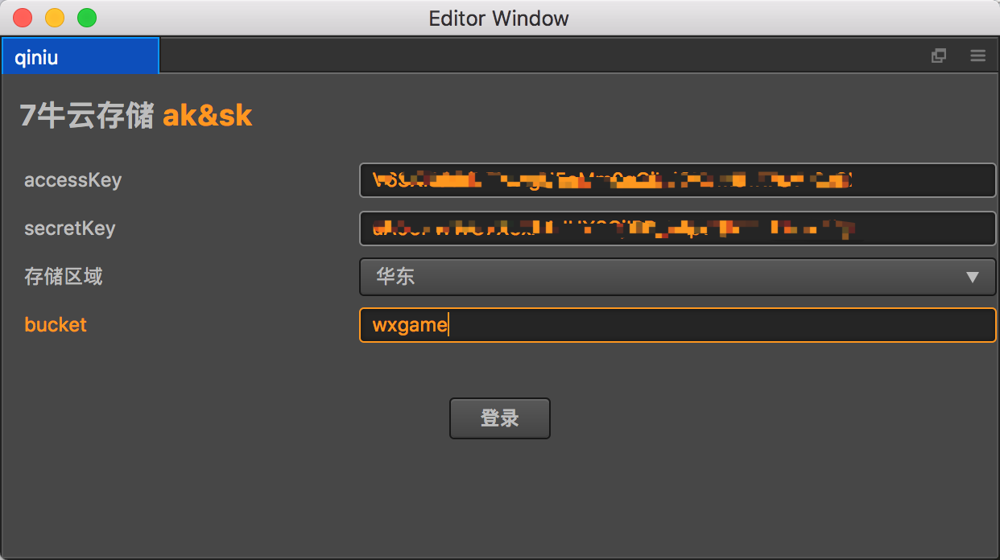
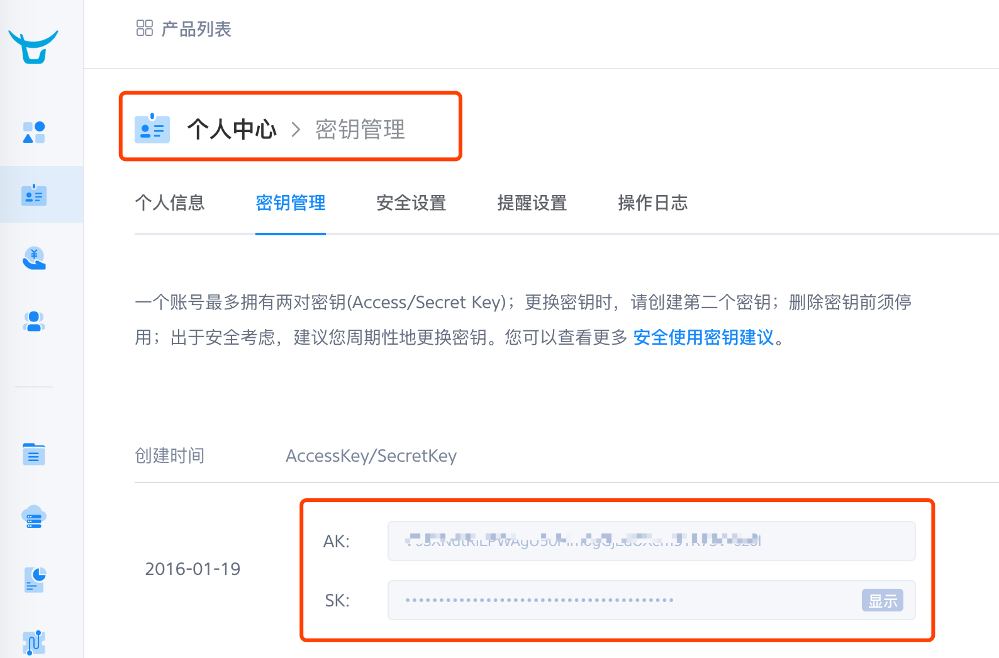
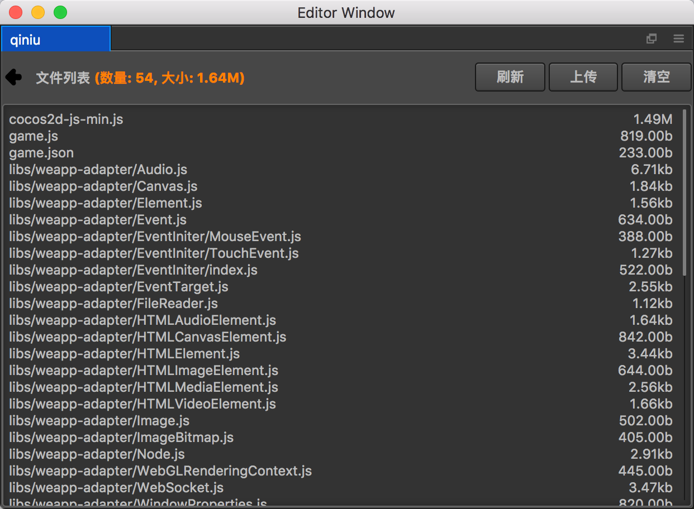
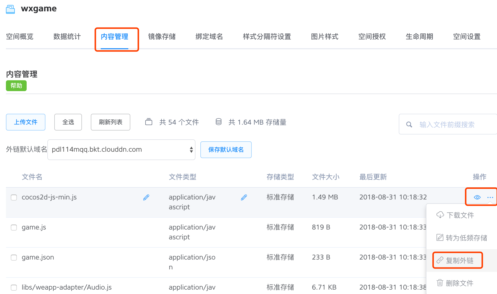

# 七牛云存储插件
使用该插件,可以快速将某个目录下的所有文件快速上传到指定的7牛云存储空间里面

## 使用说明
- 插件中使用到了7牛云存储的NodeJS社区SDK,所以第一次使用,需要在**packages/qiniu/**目录下执行node命令

        npm install

    该命令会自动安装所需要的七牛skd

- 打开插件后,如图所示,需要获取一些登录的参数
 
 
- 其中**AK**和**SK**参数,可以在七牛云存储网站的控制台**个人中心**=>**密钥管理**中获取,如图所示

- **Bucket**和**存储区**域的参数一定要和控制台的相对应

- 登录成功后,如图所示,列出了存储空间所有的存储文件

目前仅仅支持3个操作
    - 刷新: 重新获取存储空间文件列表
    - 上传: 打开文件选择对话框,上传指定的文件夹到存储空间
    - 清空: 删除存储空间所有的存储文件

## 使用建议
### 7牛云储存支持上传文件夹么?
其实像7牛这类的云存储服务,是以Key-Value的方式存储文件的,Key可以是任意符合规则的字符串,so...举个栗子:

假如我要上传**C:/test/1.png**这张图片,并且要求访问网址是 http://www.test-url.com/test/1.png ,那么我在上传**1.png**的时候,我只需要设置这个资源的key为**test/1.png**即可满足需求

通过上边的栗子,很明显,Key不一定必须是文件名.

### 上传的资源完整的访问Url时多少?
在七牛云储存的控制台,空间概览里面可以看到七牛云储存提供的临时测试域名
    
云存储完整的访问url为: 临时域名*资源key

另外在控制台的内容管理里面也可以看到空间的文件以及访问外链url  

### 其他注意事项
- 如果上传同一个文件Key,会导致之前的文件被覆盖掉,和普通的文件存储原理一样,这点需要特别注意
- 插件代码完全公开,绝对不会擅自偷取大家的上传凭据AK&SK
- 插件上传的仅仅是游戏资源,如果上传不放心,可以对游戏资源进行加密后再上传到云存储服务

### 7牛不足之处
- **https**不免费

### 这个插进能干什么
- 测试热更新,可能你需要一个资源服务器,so,7牛的免费云存储服务也许是你的一个不错选择
- 测试微信小游戏分包加载,可能你也需要一个远程资源服务器,so...
- 更多骚操作,期待你的操作...

### 后续优化
- 现在上传是需要整个文件再次重新上传一下,并没有做MD5差异上传,如果有这个必要,会在后续版本加入

### 更多疑问
欢迎加入CocosCreator插件交流QQ群:224756137

    
    
 
 
