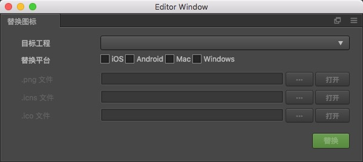

# 替换图标插件

本插件用于替换 Cocos Creator 工程的 native 平台的 icon。插件安装方法请参考[文档](http://www.cocos.com/docs/creator/extension/install-and-share.html)

## 环境要求

* Cocos Creator 1.3 以及以上版本

## 使用方法

1. 首先，需要先通过 Cocos Creator 中的 构建与发布 面板构建一次某个 native 平台（iOS/Mac/Android/Windows）
2. 通过 Cocos Creator 中主菜单的 [项目]->[替换图标] 菜单项，打开插件的操作面板。如下图：
	

3. 选择目标工程（构建 native 平台生成的 jsb-[TemplateName] 文件夹）。
4. 选项需要替换的平台。
5. 选择需要使用的 icon 文件。不同平台需要指定不同的 icon 文件。对应关系如下：
	* iOS 与 Android 需要指定 png 图片
	* Mac 需要指定 icns 文件
	* Windows 需要指定 ico 文件
6. 点击 [替换] 按钮。

## 备注

替换过程中，请注意控制台面板输出的报错或者警告信息。替换成功后，控制台面板也会输出 log 提示信息。